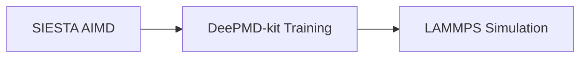

# aimd-mlp-lammps

End-to-end workflow for generating machine learning interatomic potentials from ab initio molecular dynamics (AIMD) simulations and deploying them in classical molecular dynamics simulations using LAMMPS.

The workflow was developed to study heat transport in single-molecule junctions. The example included in this repository is a gold–alkanedithiol–gold junction.

---

## Overview

The workflow consists of three sequential stages:

1. Generate AIMD trajectories using SIESTA.
2. Train machine learning interatomic potentials using DeePMD-kit.
3. Perform classical MD simulations in LAMMPS using the trained potential.



The workflow is designed for execution on HPC clusters, and example SLURM job scripts are provided throughout the repository.

---

## Repository Structure

```text
.
├── aimd/
├── deepmd_training/
├── lammps/
└── README.md
```

Detailed instructions for each stage are provided in the corresponding directory README files.

---

## Requirements

The workflow relies on the following software packages:

* SIESTA
* DeePMD-kit
* LAMMPS
* Python 3.x (for data processing)
* SLURM-enabled HPC environment

---

## Software Specifications

### 1. Ab Initio Molecular Dynamics (AIMD)

**SIESTA**

* Installation: [SIESTA Releases](https://gitlab.com/siesta-project/siesta/-/releases)
* Documentation: [SIESTA Documentation](https://docs.siesta-project.org/projects/siesta/)

### 2. Machine-Learning Potential Development

**DeePMD-kit**

* Documentation: [DeePMD-kit Documentation](https://docs.deepmodeling.com/projects/deepmd/en/latest/)

### 3. Classical Molecular Dynamics

**LAMMPS**

* Installation: [LAMMPS Download](https://www.lammps.org/download.html)
* Documentation: [LAMMPS Manual](https://docs.lammps.org/Manual.html)
* DeePMD-LAMMPS Integration: [LAMMPS with DeePMD-kit](https://docs.deepmodeling.com/projects/deepmd/en/master/third-party/lammps-command.html)

---

## Included Components

This repository contains example files and templates for:

* Example system setup for a gold–alkanedithiol–gold junction
* AIMD simulations in SIESTA
* Dataset preparation for machine learning training
* DeePMD-kit training script
* LAMMPS simulation inputs
* SLURM job submission scripts

---

## Example Results

### Machine-Learning Potential Validation


### Molecular Dynamics Simulations of Thermal Transport


---

## Author Contributions

This repository was developed to document the workflow from AIMD trajectory generation through machine learning potential training and deployment in LAMMPS MD simulations.

The repository provides input templates, processing scripts, and job submission workflows for conducting simulations on HPC systems.

---

## Notes

This workflow is provided as a research example and may require adaptation for different systems, software versions, computational resources, and simulation objectives.
